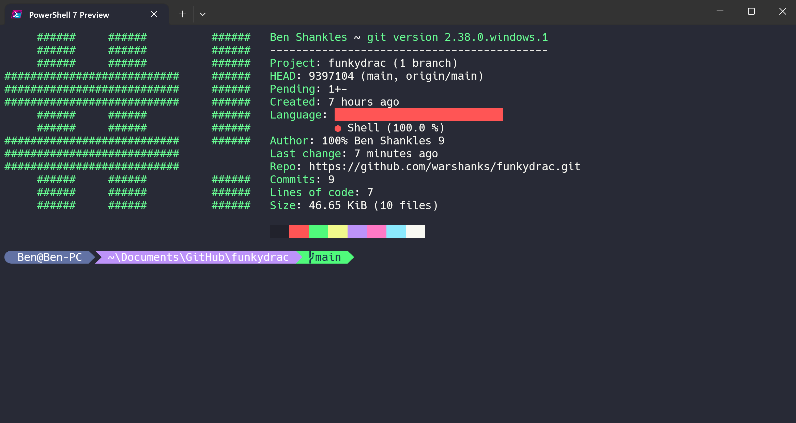

# funkydrac
### Dracula themed oh-my-zsh themes based on funky
### ... and a modified [oh-my-posh theme](#aliensdracula-oh-my-posh).
<br />

## funkydrac

## funkydrac2


### To automatically install to oh-my-zsh themes directory...
| Method    | Command                                                                                       |
|:----------|:----------------------------------------------------------------------------------------------|
| **wget**  | `sh -c "$(wget -O- https://raw.githubusercontent.com/warshanks/funkydrac/main/install.sh)"`   |

<br />

## aliensdracula (oh-my-posh)
#### This theme uses the [Dracula color scheme for Terminal](https://draculatheme.com/windows-terminal)

### To use, open $PROFILE...
```powershell
notepad $PROFILE
```
### ... and add
```powershell
oh-my-posh init pwsh --config 'https://raw.githubusercontent.com/warshanks/funkydrac/main/aliensdracula.omp.json' | Invoke-Expression
```
