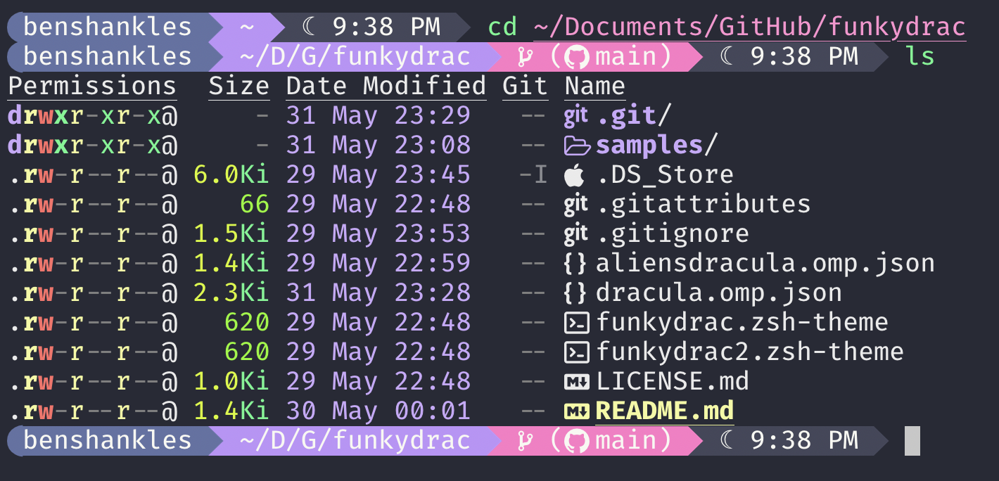

# funkydrac 🧛👻

## Dracula themed oh-my-zsh themes based on [funky](https://github.com/ohmyzsh/ohmyzsh/blob/master/themes/funky.zsh-theme), an [oh-my-posh theme](#aliensdracula-oh-my-posh) based on [aliens](https://github.com/JanDeDobbeleer/oh-my-posh/blob/main/themes/aliens.omp.json), and a fork of [dracula](https://github.com/JanDeDobbeleer/oh-my-posh/blob/main/themes/dracula.omp.json)

### These themes use the [Dracula color scheme for Windows Terminal](https://draculatheme.com/windows-terminal)

## funkydrac 🧛


## funkydrac2 👻


## aliensdracula 🛸 (oh-my-posh)


## oh-my-posh dracula fork



### To use on Windows, open $PROFILE in a text editor

```powershell
notepad $PROFILE
```

### ... and add

```powershell
oh-my-posh init pwsh --config 'https://raw.githubusercontent.com/warshanks/funkydrac/main/aliensdracula.omp.json' | Invoke-Expression
```

### ... or

```powershell
oh-my-posh init pwsh --config 'https://raw.githubusercontent.com/warshanks/funkydrac/main/dracula.omp.json' | Invoke-Expression
```

### on macOS open ~/.zprofile and add

```bash
eval "$(oh-my-posh init zsh --config https://raw.githubusercontent.com/warshanks/funkydrac/main/dracula.omp.json)"
```
